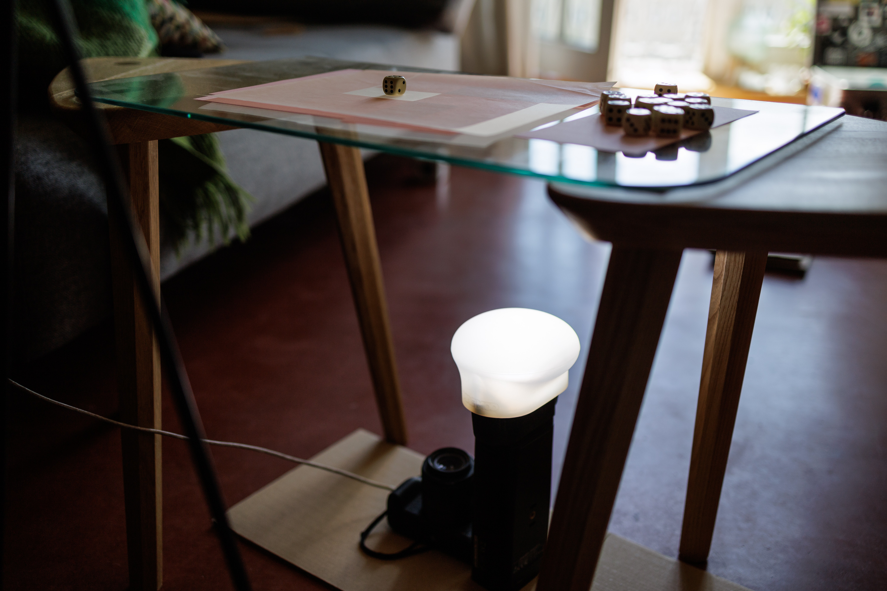

# dice-recognition
2024, Till Bovermann




recognise and count dice eyes 

## Todo

+ [ ] add ROI selection and cropping

## Installation

best to install into a virtual environment


set up a virtual environment
```bash
python -m venv .venv
source .venv/bin/activate
```

install the required packages
```bash
python -m pip install -r requirements.txt
```


## Usage

+ Stable light and background conditions are important.
+ A setup with the camera and a diffused LED light source below a glass plate worked well.
+ A translucent white sheet of paper on top of the glass removes the background and isolates the dice.
+ Adjusting the camera position to be in a slight angle helps to reduce reflections.


### single image


Requires a single image of a dice with a white background. The script will detect the dice eyes and print the result.

```bash
python getDiceEyes.py --help
```

run an example
```bash
python getDiceEyes.py --min 0.3 --max 0.9 data/dice_5_eyes_4.jpg
```


### video


Use a video source to detect dice eyes. The script will open a window and display the video stream. The dice eyes will be highlighted in the video stream.

For best results, adjust the parameters `--min` and `--max` and set the zoom level.


```bash
python videoGrabber.py --window --src 0 --fps 1 --min 0.025 --dilateIterations 2 --kernelSize 1 --max 0.08 2>/dev/null
```
